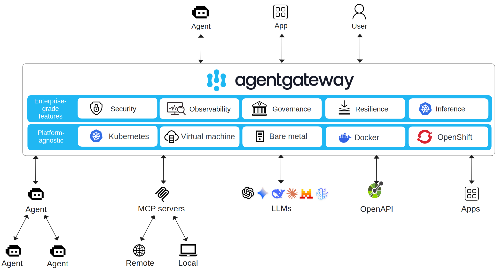

# agentgateway repository overview



*Diagram: agentgateway external connections to MCP servers, AI agents, and OpenAPI*

*(source: https://agentgateway.dev/docs/about/architecture/)*


## Overview

This document analyzes the source code of [agentgateway](https://github.com/agentgateway/agentgateway) to provide an initial look at the main initialization flow. It aims to give readers who want to dive deeper a high-level roadmap and pointers.

I am still learning Rust and the Tokio async programming style, so please let me know if you spot errors or misunderstandings.


## Motivation

People who practice [critical thinking](https://www.criticalthinking.org/pages/defining-critical-thinking/766) should first ask: why do we need yet another proxy? Aren't Nginx, HAProxy, Envoy Gateway, etc. sufficient?


The reason to build a new gateway rather than reuse an existing API gateway, service mesh, or traditional reverse proxy is that AI agent systems have unique requirements that existing gateways do not address well:

1. Protocol differences
    Interactions between AI agents commonly use newer protocols such as MCP and A2A. These involve long-lived connections, bidirectional communication, and asynchronous message streams, which are not the primary focus of traditional HTTP/REST or gRPC gateways.
2. Stateful session management
    Traditional gateways are typically stateless request/response proxies, while agent interactions often require maintaining long-running context, identity state, and sessions.
3. Security and multi-tenancy
    Agent ecosystems need finer-grained authentication, authorization, and isolation to safely share tools across users and agents.
4. Observability and governance
    Agent call chains and event streams are complex and require richer monitoring, metrics, tracing, and traffic governance than typical gateways provide.
5. Tool and service virtualization
    Agentgateway can abstract, register, and expose decentralized MCP tools or external APIs, making it easier for agents to discover and call tools dynamically.

Existing gateways therefore lack adequate support for protocol adaptation, stateful session management, security, and observability in AI-agent scenarios — motivating a gateway purpose-built for agents.


The table below compares key capabilities of traditional API gateways and Agentgateway:

| Capability | Traditional API Gateway | Agentgateway |
| --------- | ----------------------- | ------------ |
| Protocol support | HTTP/REST, gRPC | Designed for agent protocols (MCP, A2A) with bidirectional and asynchronous support |
| Connection model | Short-lived request/response | Long-lived, bidirectional streams and stateful sessions |
| Session/state management | Stateless forwarding | Maintains agent sessions, context, and identity |
| Security controls | AuthN/AuthZ (API-focused) | Fine-grained controls, multi-tenant isolation, tool-level authorization |
| Observability | Basic logs/metrics | Agent-specific tracing, event monitoring, and metrics collection |
| Traffic governance | Rate-limiting, circuit-breaking, routing | Agent-aware governance (session/tool-level) |
| Tool virtualization/discovery | None | Support for MCP tool/service registration and dynamic discovery |
| Typical scenarios | API management for clients | AI agent platform, tool/LLM/agent interconnect |


### About Agentgateway

Agentgateway is an open-source, cross-platform data plane designed for AI agent systems. It enables secure, scalable, and maintainable bidirectional connections between agents, MCP tool servers, and LLM providers. It addresses gaps in state management, long-lived sessions, asynchronous messaging, security, observability, and multi-tenancy found in traditional gateways. Features include unified access, protocol adaptation, tool virtualization, authentication and authorization, traffic governance, metrics and tracing, support for Kubernetes Gateway API, dynamic configuration updates, and an embedded developer self-service UI.

In plain terms, I view Agentgateway as an outbound bus for AI agent applications — a unified channel for external dependencies.


## Code structure

This is a typical Cargo workspace Rust project. `Cargo.toml` lists dependencies; the repo also contains several Markdown docs. `DEVELOPMENT.md` is a useful starting point for development workflows.

The `CODE_OF_CONDUCT.md` contains an interesting policy about AI usage:

```md
Usage of AI during contributions must abide by the [Linux Foundation Generative AI policy](https://www.linuxfoundation.org/legal/generative-ai).
In addition, please:
* Refrain from generating issues, comments, or PR descriptions with AI.
* Refrain from "vibe coding". AI should be used to assist and accelerate code that you (the human!) would write on your own.
* When using (non-trivial) AI assistance, please indicate this.

These policies ensure the code base is kept at a high level of quality.
Additionally, it ensures maintainers do not waste time reviewing low-quality AI-generated code.
```


This repository is organized as a Cargo workspace composed of multiple related crates. Key areas:

Top-level layout

- `Cargo.toml`: workspace root configuration file that lists member crates and shared settings.
- `crates/`: core Rust source code. Each subdirectory is an individual crate.
- `ui/`: frontend project (Next.js + React) with its own build steps.
- `examples/`: usage examples (e.g., `basic`, `tls`, `openapi`) demonstrating configurations and features.
- `schema/`: configuration schemas (`local.json`, `cel.json`) used for validation.
- `go/`: generated Go code (e.g., `*.pb.go`) from Protocol Buffers for multi-language integration.
- `architecture/`: design documents and architecture diagrams.

Important crates in `crates/`:

- `agentgateway`: core proxy logic (location: `crates/agentgateway/`). Implements routing, middleware, and proxy behavior.
- `agentgateway-app`: application binary (location: `crates/agentgateway-app/`). This crate builds the executable that ties together the library crates.
- `core`: shared types and utilities (location: `crates/core/`). Common data structures, traits, and helpers used across crates.
- `xds`: xDS API implementation (location: `crates/xds/`). Likely handles dynamic configuration via xDS and compiles protobufs in `build.rs`.
- `hbone`: HBONE protocol support (location: `crates/hbone/`). Implements HBONE (HTTP-Based Overlay Network Encapsulation) tunneling used by Istio.
- `a2a-sdk`: Agent-to-Agent SDK.
- `mock-server`: a test/mock HTTP server used for integration and e2e testing.
- `xtask`: automation tasks implemented in Rust for project maintenance and builds.

Summary

1. Core business logic: `crates/agentgateway`
2. Application entrypoint: `crates/agentgateway-app`
3. Low-level protocols: `crates/hbone`, `crates/xds`
4. UI and backend are decoupled (`ui/` vs `crates/`)
5. Examples provide practical usage scenarios


## Learning by reading code with AI assistance

The Rust + Tokio async style can be unfriendly to newcomers. I use an AI code assistant (Gemini Code Assist) in VS Code to speed up reading and understanding the code. This approach allows me to learn by exploring real-world code rather than starting with a large Rust textbook.

Unlike a search engine, the assistant answers questions within the working context and the repository, reducing manual context extraction.

## Closing thoughts

I've studied Envoy Proxy's C++ code extensively; it uses heavy OOP, polymorphism, and callback-driven design which can make the codebase verbose and conceptually dense. Agentgateway (and related projects like Istio ztunnel) use Tokio + Rust async, which resembles Go goroutines in concurrency style and tends to be more pragmatic and approachable for reading.

For readers, mastering Rust async and Tokio is a helpful prerequisite for deeper contributions.


## References

- [tokio tutorial](https://tokio.rs/tokio/tutorial/spawning)


```{toctree}
dev-env/dev-env.md
```
